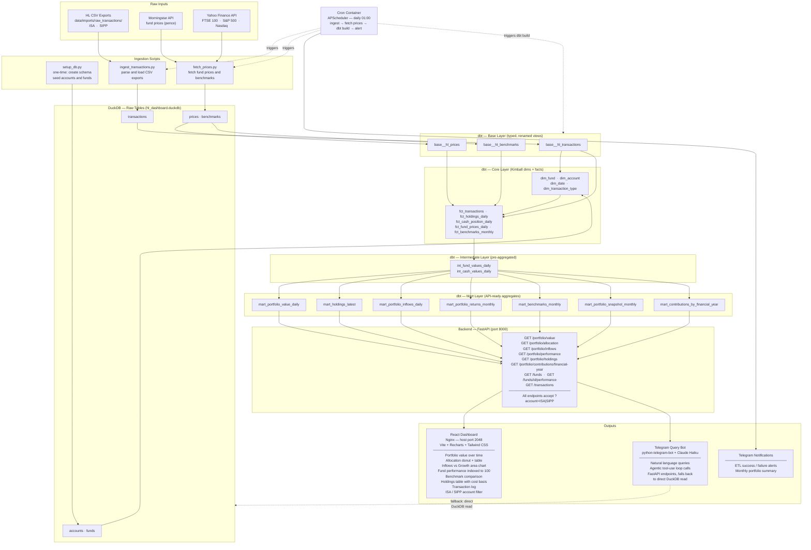

# Data Flow Diagram

End-to-end data flow from raw inputs to consumable outputs.

```mermaid
flowchart TD
    %% ── RAW INPUTS ──────────────────────────────────────────────────
    subgraph SRC["Raw Inputs"]
        CSV["HL CSV Exports\ndata/imports/raw_transactions/\nISA  ·  SIPP"]
        MSTAR["Morningstar API\nfund prices (pence)"]
        YAHOO["Yahoo Finance API\nFTSE 100  ·  S&P 500  ·  Nasdaq"]
    end

    %% ── INGESTION SCRIPTS ───────────────────────────────────────────
    subgraph SCRIPTS["Ingestion Scripts"]
        SETUP["setup_db.py\none-time: create schema\nseed accounts and funds"]
        IT["ingest_transactions.py\nparse and load CSV exports"]
        FP["fetch_prices.py\nfetch fund prices and benchmarks"]
    end

    %% ── RAW DUCKDB TABLES ───────────────────────────────────────────
    subgraph RAWDB["DuckDB — Raw Tables  (hl_dashboard.duckdb)"]
        RREF["accounts  ·  funds"]
        RTXN["transactions"]
        RPRC["prices  ·  benchmarks"]
    end

    %% ── dbt BASE LAYER ──────────────────────────────────────────────
    subgraph DBT_BASE["dbt — Base Layer  (typed, renamed views)"]
        BT["base__hl_transactions"]
        BP["base__hl_prices"]
        BB["base__hl_benchmarks"]
    end

    %% ── dbt CORE LAYER ──────────────────────────────────────────────
    subgraph DBT_CORE["dbt — Core Layer  (Kimball dims + facts)"]
        DIMS["dim_fund  ·  dim_account\ndim_date  ·  dim_transaction_type"]
        FCTS["fct_transactions  ·  fct_holdings_daily\nfct_cash_position_daily\nfct_fund_prices_daily  ·  fct_benchmarks_monthly"]
    end

    %% ── dbt INTERMEDIATE LAYER ──────────────────────────────────────
    subgraph DBT_INT["dbt — Intermediate Layer  (pre-aggregated)"]
        INT["int_fund_values_daily\nint_cash_values_daily"]
    end

    %% ── dbt MART LAYER ──────────────────────────────────────────────
    subgraph DBT_MART["dbt — Mart Layer  (API-ready aggregates)"]
        MV["mart_portfolio_value_daily"]
        MH["mart_holdings_latest"]
        MI["mart_portfolio_inflows_daily"]
        MR["mart_portfolio_returns_monthly"]
        MB["mart_benchmarks_monthly"]
        MS["mart_portfolio_snapshot_monthly"]
        MC["mart_contributions_by_financial_year"]
    end

    %% ── BACKEND ─────────────────────────────────────────────────────
    subgraph BACKEND["Backend — FastAPI  (port 8000)"]
        EP["GET /portfolio/value\nGET /portfolio/allocation\nGET /portfolio/inflows\nGET /portfolio/performance\nGET /portfolio/holdings\nGET /portfolio/contributions/financial-year\nGET /funds  ·  GET /funds/id/performance\nGET /transactions\n─────────────────────────\nAll endpoints accept ?account=ISA|SIPP"]
    end

    %% ── CRON ORCHESTRATOR ───────────────────────────────────────────
    CRON["Cron Container\nAPScheduler — daily 01:00\ningest → fetch prices → dbt build → alert"]

    %% ── OUTPUTS ─────────────────────────────────────────────────────
    subgraph OUT["Outputs"]
        FE["React Dashboard\nNginx — host port 2048\nVite + Recharts + Tailwind CSS\n─────────────────────────\nPortfolio value over time\nAllocation donut + table\nInflows vs Growth area chart\nFund performance indexed to 100\nBenchmark comparison\nHoldings table with cost basis\nTransaction log\nISA / SIPP account filter"]
        BOT["Telegram Query Bot\npython-telegram-bot + Claude Haiku\n─────────────────────────\nNatural language queries\nAgentic tool-use loop calls\nFastAPI endpoints, falls back\nto direct DuckDB read"]
        NOTIF["Telegram Notifications\n─────────────────────────\nETL success / failure alerts\nMonthly portfolio summary"]
    end

    %% ── DATA FLOW EDGES ─────────────────────────────────────────────

    %% Inputs → Ingestion
    CSV --> IT
    MSTAR --> FP
    YAHOO --> FP
    SETUP --> RREF

    %% Ingestion → Raw tables
    IT --> RTXN
    FP --> RPRC

    %% Raw tables → Base views
    RREF --> DIMS
    RTXN --> BT
    RPRC --> BP
    RPRC --> BB

    %% Base → Core
    BT --> DIMS
    BT --> FCTS
    BP --> FCTS
    BB --> FCTS
    DIMS --> FCTS

    %% Core → Intermediate
    FCTS --> INT

    %% Intermediate → Marts
    INT --> MV
    INT --> MH
    INT --> MI
    INT --> MR
    INT --> MB
    INT --> MS
    INT --> MC

    %% Marts → API
    MV --> EP
    MH --> EP
    MI --> EP
    MR --> EP
    MB --> EP
    MS --> EP
    MC --> EP

    %% API → Outputs
    EP --> FE
    EP --> BOT

    %% Bot fallback to raw DuckDB
    BOT -.->|"fallback: direct\nDuckDB read"| RAWDB

    %% Cron orchestration (dashed = triggers, not data)
    CRON -.->|"triggers"| IT
    CRON -.->|"triggers"| FP
    CRON -.->|"triggers dbt build"| DBT_BASE
    CRON --> NOTIF
```
